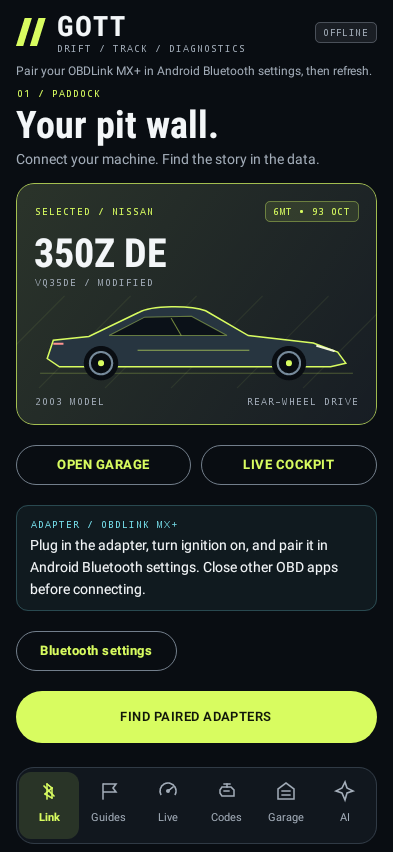
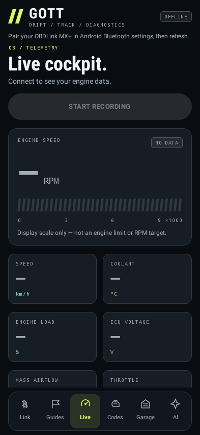
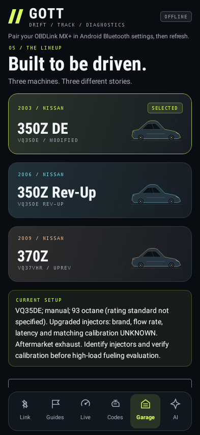

# Gott Diagnostics 1.2

Native Kotlin / Jetpack Compose Android app for an OBDLink MX+ using Bluetooth Classic SPP. Android 8.0+ (API 26). Includes guided OBD recording and direct, owner-approved OpenAI analysis inside the app.

## Install

Download `gott-diagnostics-debug.apk` from the GitHub release assets and open it on your phone. Allow installation from the file-opening app. These are development builds, not production-signed releases. The GitHub runner generates a debug signing key for each build, so Android may reject an in-place update. If an earlier version is installed, export any logs you want to keep before uninstalling it and installing 1.2. Uninstalling clears app data. The API key must be entered again after reinstalling. The release's SHA256SUMS.txt identifies the downloadable APK; a local build has a different signing key/checksum.

## Motorsport interface

Version 1.2 adds a charcoal, acid-lime and cyan design with condensed headings, stylized coupe artwork, distinct garage cards, a segmented RPM display and a two-column live telemetry dashboard. All six destinations remain visible in the bottom navigation: Link, Guides, Live, Codes, Garage and AI. Scroll position resets when switching sections, and the Stop recording button stays above the content while recording.

The RPM display is a visual scale, not an ECU redline or a recommended target. Offline/missing readings show dashes and NO DATA; stopped readings are labeled LAST READING. Vehicle illustrations are stylized, not representations of the owner's exact body modifications. The engine protocols, guide conditions, privacy controls and API behavior are unchanged.

Phone-size captures from the actual Compose UI, rendered locally in Android's host test runtime (offline, no simulated vehicle readings):

| Paddock | Live cockpit | Garage |
|---|---|---|
|  |  |  |

## Your garage

Choose a vehicle before connecting; all are manual transmission and run owner-reported 93 octane (AKI versus RON was not specified).

- 2003 350Z VQ35DE: upgraded injectors of unknown specification, aftermarket exhaust; matching calibration unknown.
- 2006 350Z VQ35DE Rev-Up: Kinetix intake manifold, full exhaust, high-flow catalytic converters; tune unknown.
- 2009 370Z VQ37VHR: cold-air intake, full exhaust with test pipes; UpRev tune believed to match the modifications but not confirmed.

Add symptoms or corrections under Garage. Each connection saves a profile snapshot. Analysis uses the profile in the recording, not whichever car you later select.

## Record and analyze

1. Plug in and pair the MX+ in Android Bluetooth settings. Close other OBD apps. Select the vehicle, turn ignition on, grant Nearby devices permission, and connect.
2. Under **Guides**, read the conditions, purpose and stop instructions, acknowledge readiness while parked, and start a recording. Or record freely under **Live**.
3. Stop recording, then scan stored and pending DTCs under **Codes** to include both in the same session. Nothing clears codes or sends ECU write commands.
4. Park, open **AI**, enter your own OpenAI API key and save it. API billing is separate from ChatGPT subscriptions; configure spending limits in your API account. The editable default model is `gpt-5.4-mini`; access depends on your project.
5. Enter a question, tap **Review data & analyze**, inspect the exact request body, and confirm **Send & analyze**. Read the answer and ask follow-ups inside the app. No ZIP or external prompt is required. ZIP export remains an optional backup.

Without an API key the app still records, scans, guides and exports. No account login, developer-owned backend, or embedded API key is used.

## Guided collection

Guides use conservative heuristics, not Nissan factory test procedures. They check advertised required PIDs first. Missing readings never count as zero or as a valid condition.

- **Cold start:** cool for at least 6 hours; connect with ignition on/engine off. Start recording, wait for the engine-start instruction, then start without throttle. Initial coolant and intake temperatures must be within 10 °C; this alone does not prove a full cold soak. Capture about 120 seconds of running data; 5-minute overall cap.
- **Warm idle:** stationary, neutral, parking brake on, outdoors, A/C off. Looks for 75–105 °C coolant and 550–1,200 RPM. Targets 60 seconds of qualifying data, with a 10-minute cap.
- **Brief neutral RPM:** only warm and normally running. Gently hold 2,000–2,500 RPM, never redline or blip. A separate timer stops recording **15 seconds after Start**, regardless of PID coverage. Release the accelerator when it stops; never extend the hold to satisfy progress. Targets at least 10 seconds of sampled qualifying coverage and 4 samples; slow adapters may yield incomplete data.
- **Steady normal driving:** set up while parked, secure the phone, avoid interaction while moving, and have a passenger operate it if needed. Observe legal driving without hard acceleration or lugging. Looks for coolant 75–105 °C, speed >15 km/h, RPM 1,200–3,500, reported load ≤60%, and speed changes ≤8 km/h between samples. Targets 90 seconds of qualifying coverage; 10-minute cap. Never alter driving to chase the timer.

High coolant temperature (>110 °C) stops a guide. Movement stops stationary guides; RPM above 3,000 stops the neutral guide. Stop for an oil-pressure warning, flashing MIL, overheating, knocking or severe rough running; the app cannot detect all unsafe conditions. For driving sessions, pull over safely before interacting with the phone. Keep the app open; it keeps the screen awake while recording but does not run a background service.

Neutral revving does not reproduce road load and cannot validate a performance tune. For high-load work use a qualified tuner, controlled dyno and suitable instrumentation. Identify the 2003's injectors and confirm matching calibration first. There is no full-throttle road guide.

## Data and privacy

- API keys are encrypted with AES-GCM using Android Keystore. Only ciphertext and its IV are stored in private preferences. Keys are excluded from diagnostic files and request bodies, and sent only in HTTPS authorization to `api.openai.com`. Redirects are disabled. Backup/device-transfer exclusions apply; the AI screen blocks screenshots.
- Each request requires confirmation. It sends the recorded vehicle profile, PID units and availability, all-session min/max/mean/count, qualifying statistics separated by guide type, the latest 30 samples, last 30 guide events, last 10 DTC scans, your question, and up to 3 prior exchanges. Long sessions are summarized; not every transient is sent. The preview shows the full body.
- Responses API requests use `store=false`; OpenAI's API data policies still apply. Requests are never automatically retried. Canceling or timing out does not guarantee cancellation of provider processing or charges.
- Conversations are kept in memory (up to 6 exchanges), not persisted across app process restarts. Session JSONL logs remain in private storage; the current or newest session can be analyzed after restart. Keys can be removed in AI settings. Clearing app storage or uninstalling removes local sessions and settings.
- There is no automatic vehicle control. AI receives no tools and cannot execute adapter commands. Its explanations are advisory and do not establish mechanical safety.

## Diagnostic coverage

Generic engine OBD-II, with advertised-PID discovery across 00/20/40. Where supported: RPM, speed, coolant, intake air, engine load, throttle, both-bank short/long fuel trims, fuel-system-1 status, MAF, manifold absolute pressure, ignition advance, engine runtime, ECU voltage and commanded equivalence ratio. Commanded equivalence ratio is not measured AFR, and narrowband O2 is not a wideband measurement. Live data uses the first responding ECU; supported-PID discovery combines responding ECU support. PID samples are sequential rather than simultaneous.

Stored (03) and pending (07) DTCs support legacy and formatted CAN replies, including numbered multi-frame output. Raw replies remain in local session logs. Threshold alerts are heuristics; fuel-system mode and vehicle-specific limits matter. ABS, airbags, individual-cylinder enhanced data, readiness/freeze-frame UI, module coding, relearns, bidirectional tests and ECU flashing are not implemented. Continue using the supported UpRev workflow for 370Z calibration changes.

## Build and validation

Use JDK 17 or 21, SDK 35, build tools 35.0.0 and the Gradle 8.9 wrapper. Set `ANDROID_HOME` or an ignored `local.properties` with `sdk.dir`.

```sh
./gradlew assembleDebug testDebugUnitTest lintDebug
```

Cloud: `./scripts/setup-cloud.sh` installs prerequisites if absent; `./scripts/build-cloud.sh` activates the retained JDK, proxy/CA settings and Maven Central mirror. Use the existing isolated checkout, without creating a worktree.

APK: `app/build/outputs/apk/debug/app-debug.apk`.

Tests exercise PID conversion/discovery, DTC decoding, unavailable data, guide completion/abort/deadline logic, bounded summaries, guide-specific statistics, API request privacy and response parsing, and mocked HTTP success/failure. No real API key, phone or vehicle is available in the cloud, so live OpenAI calls, Android Keystore/permission UI and OBD hardware behavior still require on-device validation. See BUILD_VALIDATION.md for results.
